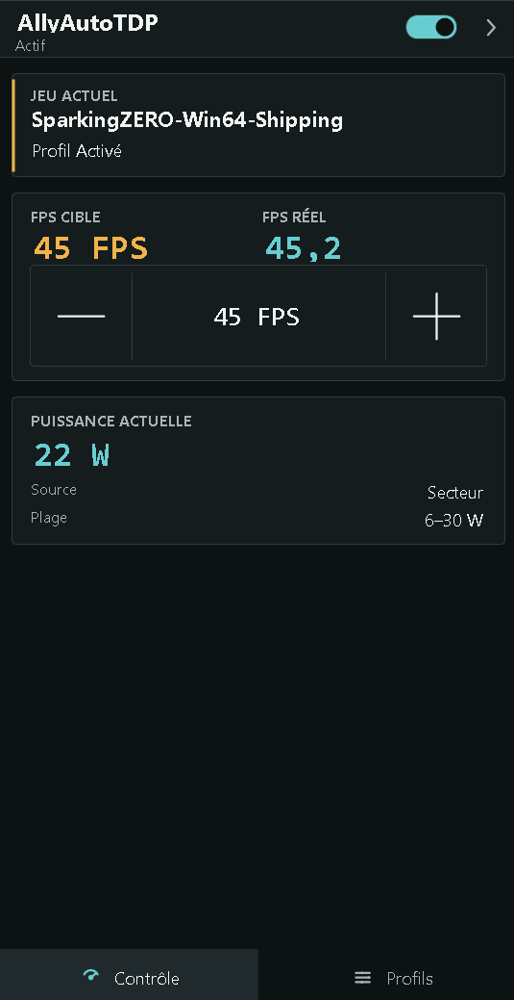
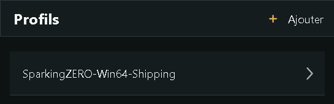
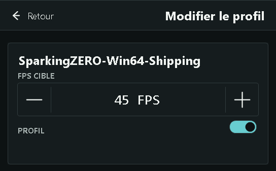
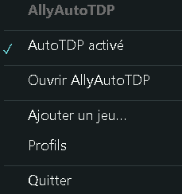

# AllyAutoTDP

AllyAutoTDP is a lightweight Windows utility specialized for the ASUS ROG Ally.
It adjusts TDP around a per-game FPS target and provides a small interface that
can be used while playing.

AllyAutoTDP is not a replacement for Armoury Crate and is not a general-purpose
utility for every gaming laptop or handheld.

## What it does

AllyAutoTDP watches the foreground application and applies AutoTDP only when
that application has an enabled AllyAutoTDP profile. Each profile is associated
with an executable and an FPS target. An application without a profile does not
start the AutoTDP engine.

The application uses AMD performance readings and ASUS power-control interfaces
to adjust TDP during the session. It keeps the configured limits separate from
the game profile:

- battery: 6–25 W;
- AC power: 6–30 W;
- unknown power source: the conservative battery ceiling.

The AC/battery source is detected automatically, and the effective range follows
the current source.

## Supported hardware

V1 has been physically validated on:

**ASUS ROG Ally Z1 Extreme — RC71L**

Other Ally models and similar handhelds may be similar, but they are not claimed
as officially validated or supported by this README.

## Features

- foreground game detection;
- per-game profiles stored by executable path;
- profile creation from the detected application;
- manual profile creation by selecting an `.exe` file;
- AutoTDP activation only for an enabled profile;
- FPS targets of 30, 40, 45, 60, 90, or 120;
- dynamic TDP adjustment within the active power range;
- automatic AC/battery range selection;
- a compact QuickPanel and system-tray icon;
- global shortcut: `Ctrl+Alt+T`.

## How AutoTDP works

For each profiled game, the user selects an FPS target. AllyAutoTDP monitors the
session's FPS and power readings, then adjusts TDP up or down within the
configured limits. The goal is to provide enough power to approach the target
without keeping an unnecessarily high power limit throughout the session.

AutoTDP does not promise perfectly locked FPS, guaranteed battery savings, or a
universal performance gain. Results depend on the game, drivers, firmware, power
source, and hardware conditions.

## QuickPanel

The QuickPanel is the main interface. It provides:

- the current foreground game and its profile state;
- an AutoTDP enable/disable toggle;
- target FPS and current FPS;
- current power, power source, and active TDP range;
- profile creation for a detected game;
- a profile list with manual `.exe` selection;
- profile editing, including target FPS, enabled state, save, and delete.

The panel can be opened from the system tray or with `Ctrl+Alt+T` when the
shortcut is available. Closing the panel hides it; the tray application remains
running.

## Installation

V1 is intended to be distributed as a portable, self-contained Windows x64
archive. When the GitHub Release is published:

1. download the V1 archive from the project's Releases page;
2. extract it to a folder;
3. run `AllyAutoTDP.exe`.

No separate .NET 8 runtime installation is required for the self-contained
release. The application requests administrator rights, so Windows displays a
UAC prompt when it starts.

The runtime depends on compatible ASUS and AMD hardware interfaces, including
AMD ADL and ASUS ACPI. Appropriate drivers and firmware must already be present
on the machine. V1 was validated with Armoury Crate SE installed and active.

AllyAutoTDP stores its configuration and logs under:

`%LocalAppData%\AllyAutoTDP\`

## Getting started

1. Launch `AllyAutoTDP.exe` and accept the UAC prompt.
2. Launch a game.
3. Open the QuickPanel from the tray or with `Ctrl+Alt+T`.
4. Create a profile for the detected game and select an FPS target.
5. Leave the profile and AutoTDP enabled for AllyAutoTDP to manage the session.

You can also open the Profiles view and add a game manually by selecting its
`.exe` file. Existing profiles can be edited or removed from that view.

## Screenshots

### QuickPanel



### Profiles



### Edit profile



### System tray



## Compatibility with Armoury Crate

AllyAutoTDP does not replace Armoury Crate. V1's hardware test procedure keeps
Armoury Crate SE active and checks behavior across its Silent, Performance, and
Turbo modes. Both applications can affect ASUS power behavior, so external mode
changes may appear while AllyAutoTDP is running. The repository makes no broader
compatibility guarantee than the documented hardware validation.

## Known limitations

- physical validation is limited to the ASUS ROG Ally Z1 Extreme (RC71L);
- AutoTDP ignores applications without an enabled AllyAutoTDP profile;
- the software does not provide an overlay, launcher, fan control, RGB control,
  or general GPU tuning;
- AutoTDP requires the expected AMD and ASUS interfaces to be available;
- software tests use fakes and do not validate real ADL, ACPI, Armoury Crate,
  touchscreen behavior, or physical panel placement;
- the global shortcut can be unavailable if another application already owns it.

## Building from source

Requirements:

- 64-bit Windows;
- .NET 8 SDK.

The application targets `net8.0-windows`, uses WinForms, and is built for x64.
From the repository root:

```powershell
dotnet restore tests/AllyAutoTDP.Tests/AllyAutoTDP.Tests.csproj
dotnet build src/AllyAutoTDP/AllyAutoTDP.csproj --configuration Release --runtime win-x64 --no-restore
dotnet test tests/AllyAutoTDP.Tests/AllyAutoTDP.Tests.csproj --configuration Release --no-restore
```

To create a self-contained local x64 output:

```powershell
dotnet publish src/AllyAutoTDP/AllyAutoTDP.csproj --configuration Release --runtime win-x64 --self-contained true --output artifacts/AllyAutoTDP-win-x64
```

The recorded V1 validation found 176 tests: 176 passed, 0 failed, and 0
skipped. No GitHub Actions CI is currently configured.

## Support

AllyAutoTDP is free and open source. If you find it useful and would like to support its development, testing, and maintenance, you can leave a voluntary tip on [Ko-fi](https://ko-fi.com/rmo).

## License and third-party work

AllyAutoTDP is licensed under the GNU General Public License v3.0 only
(`GPL-3.0-only`).

Copyright © 2026 RM

Certain low-level technical portions of AllyAutoTDP are based on or adapted
from work studied in [G-Helper](https://github.com/seerge/g-helper). G-Helper is
GPLv3 upstream provenance, not a runtime or build dependency, and AllyAutoTDP
is not a G-Helper distribution.

See the repository's [LICENSE](LICENSE),
[THIRD_PARTY_NOTICES.md](THIRD_PARTY_NOTICES.md),
[docs/licensing.md](docs/licensing.md), and
[docs/g-helper-reference.md](docs/g-helper-reference.md) for the complete
license and provenance information.
